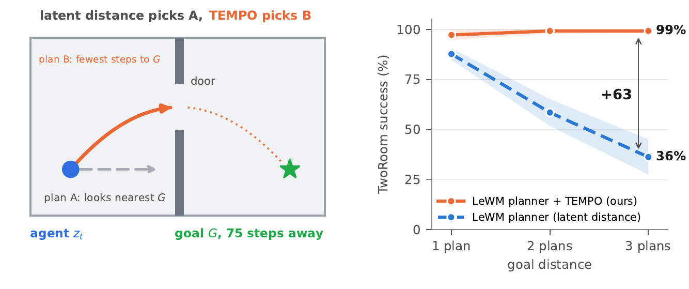
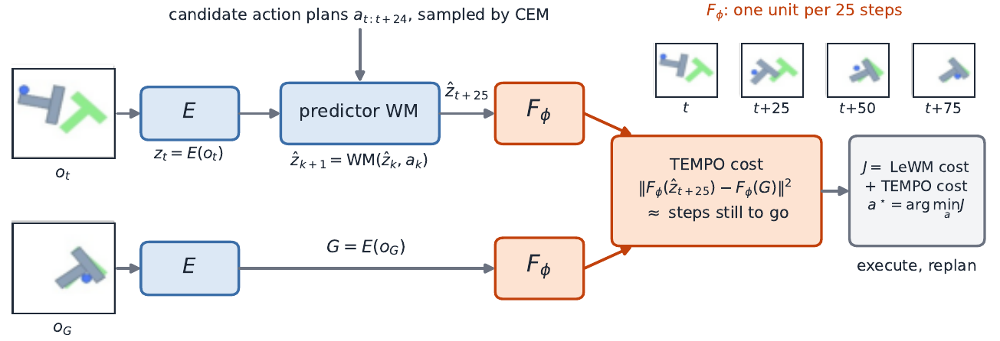

<div align="center">

# ⏱️ TEMPO

### Plan by *time to the goal*, not by latent distance

**TEMPO** (**TEM**poral-distance **P**lanning **O**bjective) is a drop-in planning cost for frozen latent world models such as **LeWM**, **PLDM** and **DINO-WM**. You don't retrain the world model, and you don't need rewards, labels or a new planner.

[](https://github.com/lamawmouk/tempo/actions/workflows/ci.yml)


[](LICENSE)

**[🌐 Project page](https://lamawmouk.github.io/tempo/)** · **[▶️ 1-minute video](https://lamawmouk.github.io/tempo/static/videos/tempo_teaser.mp4)** · 📄 arXiv (soon)



</div>

---

## Why TEMPO?

Latent world models plan by picking the action sequence whose predicted end state is **closest to the goal in latent space**. At long horizons that distance misleads the planner. A state on the wrong side of a wall can look close to the goal while being many steps away from it.

TEMPO learns a small map $F_\phi$ in which **distance counts environment steps**, then adds it to the planner's cost:

$$
J(a) \;=\; (1-w)\,\underbrace{\lVert \hat z_{t+H} - G \rVert^2}_{\text{world model's own cost}} \;+\; w\,\bar d_H^{\,2}\,\underbrace{\lVert F_\phi(\hat z_{t+H}) - F_\phi(G) \rVert^2}_{\text{steps still to go}}
$$

- 🧊 **Frozen world model.** The encoder, predictor, CEM solver, horizon and replanning cadence are all unchanged.
- 🏷️ **Label-free.** $F_\phi$ is trained only on the time indices of trajectories: the world model's offline data, then the planner's own episodes.
- 🪶 **Cheap.** One small MLP pass per candidate plan, on the end states the planner already predicts.
- 🔌 **Model-agnostic.** Works with any single-latent or patch-grid model that exposes `encode` / `rollout` through [stable-worldmodel](https://github.com/galilai-group/stable-worldmodel).

<p align="center"></p>

---

## 🚀 Quick start

```bash
git clone https://github.com/lamawmouk/tempo.git && cd tempo
python -m venv .venv && source .venv/bin/activate
pip install -e ".[envs,dev]"        # pulls the pinned stable-worldmodel
pytest                              # 38 tests, ~10 s on CPU
```

Point `STABLEWM_HOME` at your datasets and frozen checkpoints:

```
$STABLEWM_HOME/
├── datasets/      tworoom/tworoom_expert.lance, pusht_expert_train.lance, ...
└── checkpoints/   <cell>_<wm>_s<seed>/weights_epoch_10.pt        e.g. two10_lewm_s42/
```

Then run one evaluation cell:

```bash
tempo run --env tworoom --wm lewm --seed 42                            # TEMPO
tempo run --env tworoom --wm lewm --seed 42 planner.cost_weight=0      # baseline: the world model's own planner
tempo run --env pusht_split --wm pldm --seed 43 eval.goal_offset=75    # three plans ahead, unseen episodes
tempo run --env tworoom --wm lewm --seed 42 --smoke                    # tiny end-to-end check
```

A run does four stages: **encode** the training frames with the frozen encoder, train $F_\phi$ **offline** on expert windows, keep training it **online** on the planner's own episodes, then **evaluate** on 5 fixed groups of 50 windows. Results go to `runs/<cell>/eval.json`.

---

## 🧩 Use TEMPO with your own world model

TEMPO is a library as well as a CLI. If you have frozen latents for your trajectories and a stable-worldmodel planner, you need four calls:

```python
from stable_worldmodel.planning import GoalMSE, ShootingCostEvaluator
from tempo import TemporalMap
from tempo.buffer import LatentBuffer
from tempo.config import MapConfig
from tempo.objective import make_objective
from tempo.trainer import MapTrainer

buffer = LatentBuffer(latent_dim=192)
for z in trajectories:                          # (T + 1, 192) frozen latents per trajectory
    buffer.add_episode(z)

fmap = TemporalMap(latent_dim=192)              # F_phi: 192 -> 64, one unit per 25 steps
MapTrainer(fmap, buffer, MapConfig()).train(3000)

cost = make_objective(GoalMSE(), fmap, weight=0.5, scale=d_H**2)    # d_H: median 25-step latent displacement
planner_cost = ShootingCostEvaluator(world_model, cost)             # hand to CEMSolver as usual
```

`weight=0` returns your original cost unchanged, so the baseline and TEMPO always share the same planner. This snippet is tested in [`tests/test_readme_example.py`](tests/test_readme_example.py).

---

## 🌍 Environments

| | Config (`configs/envs/`) | Environment |
|---|---|---|
| 🧭 Navigation | `tworoom`, `pointmaze`, `pointmaze_large`, `antumaze`, `wall`, `wallrandom` | TwoRoom, OGBench PointMaze M / L, D4RL Ant-U-Maze, DINO-WM Wall |
| 🦾 Manipulation | `pusht`, `pushobj`, `reacher`, `cube`, `scene` | Push-T, Push-T with new block shapes, DMC Reacher, OGBench Cube / Scene |
| 🔀 Generalisation | `*_split`, `pushobj_unseen`, `wallrandom_unseen` | episodes, shapes or layouts the world model never saw |

**Add an environment** with a ~10-line YAML. It names the gym id, the dataset, the checkpoint prefix, and the reset hooks that place the env at a dataset frame:

```yaml
# configs/envs/my_env.yaml
env_id: swm/MyEnv-v0
dataset: my_env/expert.lance
cell: myenv10                       # checkpoints: myenv10_<wm>_s<seed>/weights_epoch_10.pt
callables:
  - {method: _set_state, args: {state: {value: state}}}
  - {method: _set_goal_state, args: {goal_state: {value: goal_state}}}
```

Variants inherit from a base config with `extends: my_env`. Dataset builders for the custom environments are in [`scripts/data/`](scripts/data).

---

## ⚙️ Configuration

All defaults are the paper's settings and live in [`configs/tempo.yaml`](configs/tempo.yaml). You can override any of them from the command line as `section.key=value`.

| Key | Default | Meaning |
|---|---|---|
| `planner.cost_weight` | `0.5` | $w$, the share of the TEMPO term (`0` = baseline planner) |
| `eval.goal_offset` | `25` | goal 25 / 50 / 75 steps ahead (one / two / three plans) |
| `map.kappa` | `25` | environment steps per unit of $F_\phi$ distance |
| `map.max_steps` | `75` | range over which $F_\phi$ is calibrated |
| `train.online_rounds` | `8` | rounds of 50 planner episodes used to refine $F_\phi$ |
| `planner.num_samples` / `n_steps` / `topk` | `300 / 30 / 30` | CEM, shared by every method |

**Reproduce a grid** on Slurm, with TEMPO and the baseline for every environment × world model × seed × horizon:

```bash
ENVS="tworoom pusht" WMS="lewm pldm" bash scripts/run_grid.sh
```

---

## 📁 Repository layout

```
configs/              paper defaults + one YAML per environment
src/tempo/
├── temporal_map.py   F_phi and its loss
├── buffer.py         latent trajectories, same-episode pair sampling
├── trainer.py        F_phi updates (offline + online)
├── objective.py      TEMPO cost as a stable-worldmodel Objective
├── planner.py        CEM planner policy
├── online.py         online rounds, dataset-window rollouts
├── data.py           datasets, latent cache, evaluation windows
├── world_models.py   LeWM / PLDM / DINO-WM loading and latents
├── pipeline.py       encode → offline → online → eval
├── cli.py            the `tempo` command
└── envs/             custom environments
scripts/              data collection, Slurm launchers
tests/                unit tests + an end-to-end run on a real World
```

---

## 🛠️ Troubleshooting

| Symptom | Fix |
|---|---|
| `unknown format 'lance'` | `pip install "stable-worldmodel[data]"` (included by `pip install -e .`) |
| MuJoCo rendering fails on a headless server | `export MUJOCO_GL=egl` |
| Checkpoint or dataset not found | check `STABLEWM_HOME`, or pass `--checkpoint <name>` |
| `No module named p3_swm` (Wall / WallRandom) | install the DINO-WM Wall environment package and add it to `PYTHONPATH` |

## 🤝 Contributing

Issues and pull requests are welcome. Before opening a PR, run `ruff check . && ruff format --check . && pytest`. CI runs the same checks.

## 📜 License

[MIT](LICENSE)
